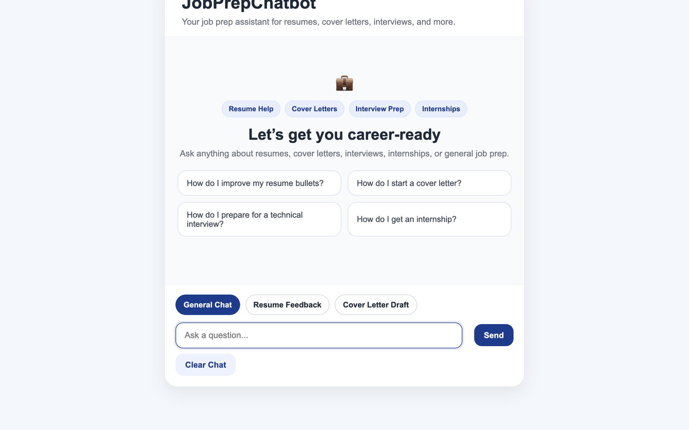
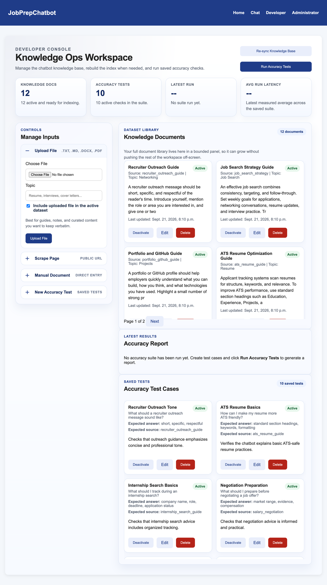

# JobPrepChatbot

A retrieval-augmented generation (RAG) chatbot for job preparation. Ask about resumes, cover letters, interviews or internships and get streamed answers grounded in a curated knowledge base, with sources cited. It also gives resume feedback and drafts cover letters from your resume plus a job description.

Team project for **CS 2340 (Objects and Design) at Georgia Tech**, Spring 2026. It was deployed on Railway with Docker.




## Features

- **Grounded Q&A:** questions are embedded and matched against a ChromaDB vector store. The top chunks go to Claude with an intent-specific prompt, and the answer streams back token by token with its sources.
- **Resume feedback** and **cover letter drafting** modes.
- **Developer console:** grow the knowledge base by uploading `.txt`, `.md`, `.docx` or `.pdf` files, scraping a URL, importing from a JSON API or typing content in. Then re-index with one click.
- **Accuracy test suite:** saved question / expected-answer / expected-source cases that can be re-run against the live pipeline to catch regressions.
- **Admin performance dashboard:** request counts, success/failure rate, and average and max latency per chat request.

## How the RAG pipeline works

```
Knowledge documents ──► preprocess ──► chunk (500 chars, 100 overlap) ──► dedupe ──► embed (MiniLM, ONNX) ──► ChromaDB
                        clean HTML,
                        strip boilerplate

User question ──► quick-reply check ──► classify intent ──► retrieve top-k chunks ──► build intent-specific prompt ──► Claude (streamed) ──► answer + sources
```

## My contributions

- **Data preprocessing pipeline (user story 7):** runs before anything is embedded.
  - `clean_html` strips scripts, styles and tags, and unescapes entities
  - `remove_boilerplate` drops nav, cookie and footer lines with a regex rule set
  - whitespace normalization
  - `deduplicate_chunks` drops near-duplicate chunks (≥80% character overlap)
- **Dynamic prompt construction (user story 8):**
  - `classify_intent` sorts each question into factual lookup, explanation, how-to, review/feedback, creative or general
  - `build_system_prompt` / `build_user_prompt` tailor the instructions and the retrieved context to that intent and topic
- **Deployment:**
  - containerized the app with Docker (collectstatic, migrations and content seeding at build time, Gunicorn)
  - deployed it to Railway, fixing CSRF trusted origins and running migrations on deploy
- **Observability:** added per-request performance logging to the streaming chat path, which feeds the admin latency dashboard.

## Screenshots

**Developer console:** knowledge base management and accuracy testing


## Tech stack

| Layer | Tech |
|---|---|
| Backend | Django 5.2, Gunicorn, WhiteNoise |
| Retrieval | ChromaDB (persistent) + all-MiniLM-L6-v2 embeddings (ONNX runtime) |
| Generation | Anthropic Claude via the `anthropic` SDK (Haiku for chat, Sonnet for resume and cover-letter tasks) |
| Ingestion | `pypdf`, `.docx` parsing, HTML scraping, JSON API import |
| Deployment | Docker, Railway |

## Run it locally

```bash
git clone https://github.com/fenais/job-prep-chatbot.git
cd job-prep-chatbot
python -m venv .venv && source .venv/bin/activate   # Windows: .venv\Scripts\activate
pip install -r requirements.txt
echo "ANTHROPIC_API_KEY=your-key-here" > .env       # never commit this file
python manage.py migrate                            # also loads the starter knowledge base
python manage.py runserver
```

Open http://127.0.0.1:8000/chat/. On first use the embedding model (~80 MB) downloads automatically. Run the tests with `python manage.py test`.

| URL | Page |
|---|---|
| `/chat/` | Chatbot |
| `/developer/` | Knowledge base and accuracy testing console (staff login) |
| `/admin-dashboard/` | Performance dashboard (staff login) |

To reach the staff pages locally, create an account with `python manage.py createsuperuser`.

## Team

Built with [@nahua3730](https://github.com/nahua3730), [@Janaalzahid](https://github.com/Janaalzahid), [@Ahelwa6](https://github.com/Ahelwa6) and [@natalieseng](https://github.com/natalieseng). The full commit history is preserved in this repo.
